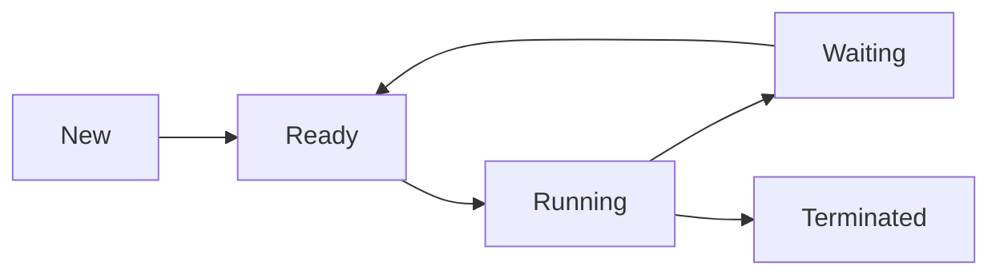

# Interview Revision Guide for L1 Software Developer at HackWithInfinity

## Executive Summary  
This guide compiles a thorough set of high-impact interview questions across **DBMS, OOPs, OS, DSA, and SQL** for an L1 developer role. Each section lists 40–60 questions (basic to advanced) with concise answers, key concepts, examples, common pitfalls, and memory tips. We draw on authoritative sources (textbooks, GeeksforGeeks, InterviewBit, etc.) to ensure accuracy. The goal is to reinforce fundamentals, clear doubts, and scale up understanding before the interview.

- **Scope:** Core concepts in each subject with focus on practical interview relevance.  
- **Format:** Questions grouped by topic and difficulty; each Q has a short answer, key concept bullet, example/code snippet if applicable, pitfalls, and a one-line mnemonic.  
- **Outcome:** By studying these Q&A, you’ll cover essential theory (ACID, normal forms, OOP principles, process vs thread, sorting algorithms, etc.) and practice examples. This ensures quick recall under pressure and helps diagnose weak areas.

Throughout, we cite trusted references (e.g. GFG, standard texts). Tables compare related concepts (e.g. JOIN types, OS schedulers, normal forms). A 2-week study plan and summary are provided to structure preparation.


# DBMS (Database Management Systems)

### Basic

**Q: What is a DBMS and why use it?**  
**Answer:** A DBMS is software that enables creation, storage, modification, and retrieval of data in a database【32†L1-L4】. It provides data abstraction and management, reducing redundancy and inconsistency while improving security and concurrency.  
- **Key Concept:** Structured data storage with ACID properties.  
- **Example:** Using SQL commands (CREATE, INSERT, SELECT) to manage records.  
- **Pitfall:** Thinking a database is only the data; a DBMS is the whole management layer.  
- **Tip:** *Database = data; DBMS = Toolbox for that data【32†L1-L4】.*

**Q: Define a *database* vs a *DBMS*.**  
**Answer:** A **database** is an organized collection of data stored logically【32†L7-L11】. A **DBMS** is the software/tools that interact with the database (e.g. MySQL, PostgreSQL)【32†L1-L4】.  
- **Key Concept:** Data vs management layer.  
- **Example:** Employee records stored in tables (database) accessed via Oracle or MySQL (DBMS).  
- **Pitfall:** Confusing file system with database; DBMS has indexing and query support.  
- **Tip:** *“DBMS” manages the “DB.”*

**Q: What is a *Primary Key*? How is it different from a *Unique* key?**  
**Answer:** A primary key uniquely identifies each table row and enforces NOT NULL. Only one primary key per table (can be composite)【22†L100-L107】. A unique key also enforces uniqueness but allows NULLs and you can have multiple unique constraints【32†L49-L52】.  
- **Key Concept:** Uniqueness and nullability.  
- **Example:** `emp_id` could be PK in Employee; but `email` might be UNIQUE (can be null).  
- **Pitfall:** Setting multiple PKs or expecting UNIQUE to block NULLs.  
- **Tip:** *“Primary = main, no nulls; Unique = unique, but null ok”【32†L49-L52】.*

**Q: What are the ACID properties?**  
**Answer:** ACID stands for **Atomicity**, **Consistency**, **Isolation**, **Durability** – the four guarantees of reliable transaction processing【7†L431-L440】. Atomicity means all-or-nothing, Consistency preserves rules before/after, Isolation avoids interference, Durability means once committed, data persists【7†L431-L440】.  
- **Key Concept:** Transaction integrity.  
- **Example:** Transferring money involves debit+credit: atomicity ensures both happen or none.  
- **Pitfall:** Overlooking that isolation overhead may slow parallel transactions.  
- **Tip:** *“ACID = reliability guarantees”【7†L431-L440】.*

**Q: List SQL sublanguages in DBMS.**  
**Answer:** SQL has sublanguages: DDL (Data Definition Language: CREATE, ALTER, DROP), DML (Data Manipulation: SELECT, INSERT, UPDATE, DELETE), DCL (Data Control: GRANT, REVOKE), and TCL (Transaction Control: COMMIT, ROLLBACK, SAVEPOINT)【4†L149-L160】. Each has distinct commands.  
- **Key Concept:** SQL is grouped by functionality.  
- **Example:** `CREATE TABLE students (...);` (DDL), `INSERT INTO students ...;` (DML).  
- **Pitfall:** Confusing DCL vs DML.  
- **Tip:** *Think DDL = structure, DML = content, DCL = permissions, TCL = transactions【4†L149-L160】.*

**Q: Explain *normalization* and list 1NF, 2NF, 3NF.**  
**Answer:** Normalization restructures tables to reduce redundancy and anomalies【22†L119-L127】. 
- **1NF:** Atomic values, no repeating groups (each cell holds one value).  
- **2NF:** 1NF + no partial dependencies on part of a composite key (every non-key depends on whole PK)【22†L123-L127】.  
- **3NF:** 2NF + no transitive dependencies (non-keys depend only on the PK, not other non-keys)【22†L125-L128】.  
- **Key Concept:** Decomposition and dependencies.  
- **Example:** A table with (StudentID, Course, InstructorName) violates 2NF if Instructor depends only on Course, not full (StudentID, Course).  
- **Pitfall:** Over-normalizing can hurt read performance.  
- **Tip:** *Normalize stepwise: eliminate duplicates, partial deps, then transitive deps【22†L123-L129】.*

**Table: Summary of Normal Forms【22†L123-L129】**  

| Normal Form | Rule                                                       |
|-------------|------------------------------------------------------------|
| 1NF         | Atomic columns; no repeating groups                       |
| 2NF         | 1NF + no partial dependency on part of a composite key     |
| 3NF         | 2NF + no transitive dependency (non-key depends only on key)【22†L123-L128】 |
| BCNF        | Every determinant is a candidate key (stronger than 3NF)   |
| 4NF         | No multi-valued dependencies                              |
| 5NF (PJNF)  | Decompose so tables recombine without spurious tuples     |

*(4NF/5NF are rare in basic interviews unless data warehousing topics.)*

**Q: Describe differences between DELETE and TRUNCATE in SQL.**  
**Answer:** Both remove table rows, but DELETE removes row-by-row (can have WHERE, logs each deletion) whereas TRUNCATE removes all rows instantly, resetting identity counters, and cannot be rolled back in some DBs【32†L63-L71】. TRUNCATE is faster but less flexible (no WHERE).  
- **Key Concept:** DML vs DDL behavior.  
- **Example:** `DELETE FROM students WHERE age>20;` vs `TRUNCATE TABLE students;`.  
- **Pitfall:** Using TRUNCATE when you only wanted to delete some rows – it wipes all.  
- **Tip:** *DELETE = slow and selective (logs), TRUNCATE = fast and wholesale*.

### Intermediate

**Q: What is an *index*? When use clustered vs non-clustered?**  
**Answer:** An index is a data structure (often B-tree) that speeds up lookups on a column【22†L155-L163】. A **clustered index** orders the physical table rows by the key (only one per table, ideal for range scans)【22†L155-L163】. A **non-clustered index** is a separate structure (key → row locator) (many allowed, good for specific searches)【22†L155-L163】.  
- **Key Concept:** Speed vs storage trade-offs.  
- **Example:** Primary key is usually clustered (ordered by ID), while an index on a secondary column (e.g. last_name) is non-clustered.  
- **Pitfall:** Over-indexing slows writes.  
- **Tip:** *Clustered = table physically sorted by PK; non-clustered = extra lookup table【22†L155-L163】.*

**Q: Explain *transactions* and *ACID*.**  
**Answer:** A transaction is a sequence of DB operations executed as a single logical unit. ACID ensures a transaction leaves the DB consistent: Atomicity and Durability were defined above【7†L431-L440】.  
- **Key Concept:** All-or-nothing DB operations.  
- **Example:** Transferring funds: debit from A and credit to B must both succeed or both fail.  
- **Pitfall:** Assuming autocommit; must explicitly COMMIT/ROLLBACK in multi-step ops.  
- **Tip:** *Transaction = a “unit” of work with ACID guarantees.*

**Q: What are *stored procedures* and *triggers*?**  
**Answer:** A **stored procedure** is a saved set of SQL statements that can take parameters and be invoked explicitly to perform operations (improves reuse/performance). A **trigger** is a special procedure that automatically fires on events (INSERT/UPDATE/DELETE) on a table【7†L462-L471】【7†L471-L477】.  
- **Key Concept:** Stored = manually invoked; Trigger = event-driven.  
- **Example:** `CREATE PROCEDURE GetUser(IN uid INT) SELECT * FROM Users WHERE id=uid;` (stored procedure). `CREATE TRIGGER logUpdate AFTER UPDATE ON Orders FOR EACH ROW INSERT INTO AuditLog ...;` (trigger).  
- **Pitfall:** Overusing triggers can make DB behavior hard to track.  
- **Tip:** *Proc = explicit call, trigger = automatic on event【7†L462-L471】【7†L471-L477】.*

**Q: What is *query optimization*?**  
**Answer:** The DBMS’s process of choosing the most efficient execution plan for a query【32†L97-L100】. It involves cost estimation, index selection, join algorithms, etc., to minimize resource use.  
- **Key Concept:** Execution plan selection for speed.  
- **Example:** A query with JOINs might be optimized by using an index to avoid a full table scan.  
- **Pitfall:** Assuming indexes always help; poor indexes or outdated stats can mislead the optimizer.  
- **Tip:** *Think: Optimize the “how” of retrieval, not the “what.”*

**Q: Explain *JOIN* types with examples.**  
**Answer:** JOINs combine rows from two tables by matching keys【22†L91-L98】. 
- **INNER JOIN:** Returns only rows matching in both tables (intersection).  
- **LEFT JOIN:** All rows from left table + matched right; unmatched right-side columns are NULL.  
- **RIGHT JOIN:** All rows from right table + matched left; unmatched left-side columns are NULL.  
- **FULL OUTER JOIN:** All rows from both tables; non-matches fill with NULL【22†L91-L98】.  
- **Example:**  
  - INNER: `SELECT * FROM A INNER JOIN B ON A.id=B.a_id;` (only matching rows).  
  - LEFT: `SELECT * FROM A LEFT JOIN B ON A.id=B.a_id;` (all A, B data where matched).  
- **Pitfall:** Mistaking LEFT vs RIGHT direction.  
- **Tip:** *Inner = overlap; Left/Right = include all from one side; Full = both sides【22†L91-L98】.*  

**Q: Difference between WHERE and HAVING?**  
**Answer:** `WHERE` filters rows **before** aggregation, cannot use aggregates; `HAVING` filters groups **after** `GROUP BY`, so can use aggregates【22†L68-L76】.  
- **Key Concept:** Filter timing.  
- **Example:**  
  ```sql
  SELECT dept, COUNT(*) c FROM employees 
  WHERE salary > 50000 
  GROUP BY dept 
  HAVING COUNT(*) > 10;
  ```  
  (WHERE filters salaries >50k first, then HAVING filters departments with >10 employees).  
- **Pitfall:** Trying to put `COUNT(*) > 10` in WHERE (invalid).  
- **Tip:** *WHERE filters rows, HAVING filters groups【22†L68-L76】.*  

**Q: What are *UNION* vs *UNION ALL*?**  
**Answer:** `UNION` merges results of two queries and removes duplicates (implies an implicit DISTINCT)【22†L134-L142】. `UNION ALL` merges without removing duplicates, so it’s faster.  
- **Key Concept:** Duplicate handling.  
- **Example:**  
  ```sql
  SELECT Name FROM Customers
  UNION
  SELECT Name FROM Employees;  -- no dupes
  SELECT Name FROM Customers
  UNION ALL
  SELECT Name FROM Employees;  -- keep dupes
  ```  
- **Pitfall:** Assuming UNIONS are always faster (they do extra work to dedupe).  
- **Tip:** *If you know sets are disjoint or don’t care about duplicates, use UNION ALL for speed【22†L134-L142】.*

**Q: Explain *normalization* (brief).**  
**Answer:** See normalization table above. It organizes tables to minimize redundancy by dividing data into related tables, following 1NF, 2NF, 3NF rules【22†L119-L128】.  
- **Key Concept:** Minimize redundancy and anomalies.  
- **Example:** Storing address in a separate table linked by ID instead of repeating address in every order row.  
- **Pitfall:** Many-to-many relationships must be broken into join tables.  
- **Tip:** *Aim for each fact to appear once in an optimal schema.*

### Advanced

**Q: What is a *deadlock* in DBMS and how avoid it?**  
**Answer:** Deadlock: two transactions each hold a lock and wait for the other, so none can proceed. Conditions: mutual exclusion, hold-and-wait, no preemption, circular wait【31†L47-L54】.  
- **Key Concept:** Cyclic resource wait.  
- **Example:** T1 locks row A then tries to lock B; T2 locks B then tries to lock A.  
- **Pitfall:** Ignoring lock ordering can create deadlocks.  
- **Tip:** *Avoid circular waits; e.g., always lock tables in fixed order.*  

**Q: Explain isolation levels (e.g., Read Committed vs Serializable).**  
**Answer:** Isolation levels control visibility of concurrent transactions. **Read Committed** forbids dirty reads; **Repeatable Read** prohibits non-repeatable reads; **Serializable** is the strictest (fully isolated) level. Lower isolation allows more concurrency but risks anomalies.  
- **Key Concept:** Trade-offs between consistency and performance.  
- **Example:** In Read Committed, T1 sees only data another transaction has committed, preventing reading uncommitted changes.  
- **Pitfall:** Avoid assuming default is Serializable (often it’s lower).  
- **Tip:** *“Dirty, Non-repeatable, Phantom” anomalies dictate isolation choice.*  

**Q: What are *INDEXes* used for?**  
**Answer:** Indexes speed up data retrieval by creating a search-friendly structure on one or more columns. They can drastically reduce query time at the cost of slower writes and extra storage.  
- **Key Concept:** Time-space trade-off.  
- **Example:** Index on `last_name` column lets queries like `WHERE last_name='Smith'` run in ~O(log n) instead of O(n).  
- **Pitfall:** Too many indexes slow down INSERT/UPDATE/DELETE (need to update all indexes).  
- **Tip:** *Index columns used in WHERE/JOIN/ORDER BY for frequent queries.*  

**Q: Compare *primary key*, *unique key*, and *foreign key*.**  
**Answer:** 
- **Primary key:** Uniquely identifies rows, implies NOT NULL, one per table【22†L100-L107】.  
- **Unique key:** Enforces uniqueness but allows one NULL (in many DBs) and multiple unique constraints per table【32†L49-L52】.  
- **Foreign key:** A column (or set) that references another table’s primary key, enforcing referential integrity (value must exist in parent or be NULL)【22†L100-L107】.  
- **Pitfall:** Adding a foreign key on non-indexed column can slow joins.  
- **Tip:** *PK = identity, UNIQUE = uniqueness, FK = link to parent PK.*  

**Q: What is *denormalization*?**  
**Answer:** Denormalization is intentionally merging tables or duplicating data to improve read performance at the cost of redundancy. It’s done when joins are too costly.  
- **Key Concept:** Performance vs redundancy.  
- **Example:** Storing a customer’s full address in the Orders table to avoid joining Customers every time.  
- **Pitfall:** Increased risk of inconsistency if updates fail to propagate.  
- **Tip:** *Only denormalize after measuring that joins are bottlenecks.*  

**Q: Explain a *Foreign Key* constraint (with example).**  
**Answer:** A foreign key in table B references a primary key in table A, ensuring that any value in B exists in A or is NULL. This enforces relationships between tables.  
- **Key Concept:** Referential integrity.  
- **Example:** `ORDER(customer_id)` might reference `CUSTOMER(id)`. If you try to insert an order with customer_id=99 but no CUSTOMER(99), it will error.  
- **Pitfall:** Orphan records if FK constraints are absent or disabled.  
- **Tip:** *“No dangling pointers” – every FK points to a real PK.*  

**Q: What is *View* in SQL?**  
**Answer:** A view is a virtual table based on a SELECT query. It does not store data itself but presents data from underlying tables【22†L50-L55】. Views simplify complex queries and can restrict user access.  
- **Key Concept:** Virtual abstraction layer.  
- **Example:** `CREATE VIEW HighSpenders AS SELECT name, SUM(amount) AS total FROM Sales GROUP BY name HAVING SUM(amount)>1000;`.  
- **Pitfall:** Updating views isn’t always possible (especially if they join multiple tables).  
- **Tip:** *Think of view as a saved query.*  

---

# OOP (Object-Oriented Programming)

### Basic

**Q: What is OOP? Name its four pillars.**  
**Answer:** OOP is a programming paradigm organizing code into *objects* (instances of *classes*) containing data and methods. The four pillars are **Encapsulation, Abstraction, Inheritance, Polymorphism**【29†L29-L33】.  
- **Key Concept:** Real-world modeling via classes/objects.  
- **Example:** A `Car` class with attributes (color, model) and methods (drive, brake).  
- **Pitfall:** Using OOP with poor design can lead to overly complex inheritance trees.  
- **Tip:** *“OOP = Objects with data+behavior, using the 4 pillars”【29†L29-L33】.*

**Q: Define *Class* and *Object*.**  
**Answer:** A **class** is a blueprint defining attributes (fields) and behaviors (methods). An **object** is an instance of a class created at runtime.  
- **Key Concept:** Template vs instance.  
- **Example:** `class Dog { String name; void bark() { ... } } Dog d = new Dog();` (here `Dog` is class, `d` is an object).  
- **Pitfall:** Forgetting to initialize object (null pointer).  
- **Tip:** *Class = type; object = variable of that type.*  

**Q: What is *encapsulation*?**  
**Answer:** Encapsulation bundles data and methods into a single unit (class) and restricts access using modifiers (private, public)【29†L35-L43】. It hides internal state, exposing only what’s necessary (via getters/setters).  
- **Key Concept:** Data hiding and control.  
- **Example:** Class `Account` has private `balance`, and public methods `deposit()`, `withdraw()` controlling how balance changes.  
- **Pitfall:** Overexposing fields (making them public) breaks encapsulation.  
- **Tip:** *Private fields + public accessors = encapsulation.*  

**Q: What is *inheritance*?**  
**Answer:** Inheritance allows a class (child) to acquire properties/methods of another (parent). It represents an “is-a” relationship【29†L98-L105】.  
- **Key Concept:** Code reuse and hierarchy.  
- **Example:** `class Animal { } class Dog extends Animal { }`. `Dog` inherits from `Animal`.  
- **Pitfall:** Using inheritance where composition is better (see is-a vs has-a).  
- **Tip:** *Prefer “has-a” (composition) if the relationship is not truly is-a.*  

**Q: Explain *polymorphism*.**  
**Answer:** Polymorphism means “many forms” – the same interface can have multiple implementations【29†L49-L53】. It allows treating objects of different classes through a common interface, and the correct method is chosen at runtime (dynamic binding).  
- **Key Concept:** Flexibility and extensibility.  
- **Example:** 
  ```java
  interface Payment { void pay(); }
  class CreditCard implements Payment { void pay(){...} }
  class PayPal implements Payment { void pay(){...} }
  Payment p = new PayPal(); p.pay();  // calls PayPal.pay()
  ```  
- **Pitfall:** Overuse can make code harder to follow without clear interfaces.  
- **Tip:** *“One interface, multiple implementations”【29†L49-L53】.*  

**Q: Difference between *method overloading* and *overriding*.**  
**Answer:** **Overloading** is having multiple methods in the same class with the same name but different parameters (compile-time polymorphism). **Overriding** is a subclass providing its own implementation of a method from its parent (runtime polymorphism)【29†L129-L137】.  
- **Key Concept:** Compile-time vs runtime polymorphism.  
- **Example:**  
  ```java
  class Calc { int add(int a,int b){} int add(int a,int b,int c){} } // overloading
  class Animal { void speak(){} } class Dog extends Animal { void speak(){} } // overriding
  ```  
- **Pitfall:** Forgetting that signatures must differ exactly to overload (or method must be same signature to override).  
- **Tip:** *Overload = same name, diff params; Override = same name & signature in child class【29†L129-L137】.*  

**Q: What is *abstraction*?**  
**Answer:** Abstraction means exposing only relevant features of an object, hiding complexity. Achieved via abstract classes or interfaces that declare methods without full implementation.  
- **Key Concept:** Simplicity via hiding detail.  
- **Example:** Abstract class `Vehicle` with `drive()` method declared, implemented by `Car` and `Bike`.  
- **Pitfall:** Abstraction without necessity can overcomplicate design.  
- **Tip:** *Abstract classes/interfaces define “what,” subclasses define “how.”*  

**Q: What is the difference between *abstract class* and *interface* in Java?**  
**Answer:** An abstract class can have both implemented and abstract methods; a class may extend only one abstract class. An interface (Java 8+) can have method signatures and default methods; a class can implement multiple interfaces【29†L68-L77】. Use abstract classes for shared base behavior, interfaces for capability contracts across unrelated classes【29†L68-L77】.  
- **Key Concept:** Multiple inheritance of type vs single inheritance of implementation.  
- **Example:** `abstract class Bird { abstract void fly(); } interface Swimable { void swim(); } class Duck extends Bird implements Swimable { ... }`.  
- **Pitfall:** Using interface when you need shared fields (interfaces can’t hold state).  
- **Tip:** *Interface = pure contract (multiple); abstract class = base with some code (one).*

**Q: What is *constructor* and destructor (in languages like C++)?**  
**Answer:** A constructor initializes a new object’s state when created. A destructor (in languages like C++) is called when an object is destroyed, for cleanup. In Java, `finalize()` used to serve similar purpose but is deprecated.  
- **Key Concept:** Object lifecycle hooks.  
- **Example:** `class Foo { Foo(){ System.out.println("init"); } }`.  
- **Pitfall:** In C++, forgetting to free dynamic memory in destructor causes leaks. In Java, not applicable (GC handles it).  
- **Tip:** *Constructor = setup; destructor = teardown (manual memory languages only).*  

### Intermediate

**Q: Explain *encapsulation* vs *data hiding*.**  
**Answer:** Encapsulation is bundling data and methods into classes. Data hiding specifically means restricting access to class internals via private/protected modifiers. You can have encapsulation without strict hiding (e.g., public fields) but not data hiding without encapsulation【29†L35-L43】.  
- **Key Concept:** Privacy of internals.  
- **Example:** A class with private fields and public methods.  
- **Pitfall:** Thinking encapsulation automatically means private; you still must design proper interfaces.  
- **Tip:** *Encapsulation = package; data hiding = lock the package.*  

**Q: What is *has-a* vs *is-a* relationship?**  
**Answer:** *Is-a* implies inheritance (e.g. Dog **is-a** Animal). *Has-a* implies composition (e.g. Car **has-an** Engine)【29†L98-L105】. Misusing inheritance for a has-a relation leads to poor design (tight coupling)【29†L98-L105】.  
- **Key Concept:** Composition vs inheritance.  
- **Example:** `class Engine{}`; `class Car{ Engine e; }` (has-a); versus `class SportsCar extends Car{}` (is-a).  
- **Pitfall:** Letting inheritance dominate even when classes don’t truly share an “is-a” relationship.  
- **Tip:** *Use inheritance for taxonomy; composition for building blocks.*  

**Q: How does polymorphism remove “switch-case” in OOP?**  
**Answer:** Instead of using a switch on types, polymorphism lets each class handle its own behavior. E.g., instead of `if(type==Circle) drawCircle() else if(type==Square) drawSquare()`, use a common interface `Shape { draw(); }` and call `shape.draw()`. This follows the Open/Closed principle【29†L105-L115】.  
- **Key Concept:** Dynamic dispatch replaces conditional logic.  
- **Example:** See shapes example in [29†L107-L115].  
- **Pitfall:** Hard to add new conditions with switch-case; polymorphism avoids modifying existing code.  
- **Tip:** *Switch-case hell → use polymorphic calls.*  

**Q: What is *tight coupling* and why avoid it?**  
**Answer:** Tight coupling means classes depend heavily on each other’s implementations. It violates OOP principles (open/closed) and makes maintenance/hot-swapping hard【29†L143-L152】. E.g., if class Car hard-codes `PetrolEngine`, you can’t easily change to DieselEngine.  
- **Key Concept:** Loose coupling for flexibility.  
- **Example:** Use an `Engine` interface instead of a concrete engine class, and inject it.  
- **Pitfall:** High coupling makes code brittle and un-testable.  
- **Tip:** *“Program to interfaces, not implementations.”*  

**Q: How can inheritance misuse break encapsulation?**  
**Answer:** A subclass can access protected fields/methods of a parent, potentially bypassing validation or business rules【29†L154-L162】. E.g., if `Account` has protected `balance`, a subclass could change it directly instead of through deposit/withdraw methods, breaking invariants.  
- **Key Concept:** Subclass can manipulate parent’s internals if not private.  
- **Pitfall:** Using protected instead of private for fields can lead to leaks.  
- **Tip:** *Keep fields private, expose only safe methods【29†L154-L162】.*  

**Q: Briefly describe *SOLID* principles.**  
**Answer:**  
- **S**: Single Responsibility – a class does one thing.  
- **O**: Open/Closed – extendable without modifying existing code.  
- **L**: Liskov Substitution – subclass should be usable anywhere its base is used (no surprises).  
- **I**: Interface Segregation – many small, specific interfaces rather than one large.  
- **D**: Dependency Inversion – depend on abstractions, not concretions.  
These design principles improve maintainability and flexibility.  
- **Tip:** *Every SOLID rule enhances modularity and robustness.*  

### Advanced

**Q: What are design patterns? Name 2 examples.**  
**Answer:** Reusable solutions to common design problems. E.g., **Factory** (creates objects without specifying exact class) and **Observer** (one-to-many notification) patterns.  
- **Key Concept:** Proven blueprint for design.  
- **Example:** Using a Logger class as Singleton so only one instance exists.  
- **Pitfall:** Overusing patterns can overcomplicate simple designs.  
- **Tip:** *Use patterns to solve recurring design issues, not just for the sake of using them.*  

**Q: How to implement thread safety in OOP?**  
**Answer:** Use synchronization mechanisms (mutexes/locks) to control access to shared data. Minimize lock scope, use immutable objects, or use concurrent libraries.  
- **Key Concept:** Race condition avoidance.  
- **Pitfall:** Over-synchronizing can cause deadlocks or performance bottlenecks.  
- **Tip:** *Lock the smallest critical section needed.*  

**Q: Explain Liskov Substitution Principle with example.**  
**Answer:** LSP states objects of a subclass should be substitutable for a base class without altering program correctness. Violation example: A `Square` class inherits `Rectangle`, but setting width and height independently breaks Square’s invariants (size must remain equal).  
- **Key Concept:** No unexpected behavior in subclasses.  
- **Pitfall:** Tight coupling to base class behaviors.  
- **Tip:** *Check that subclass methods fulfill base class contracts.*  

**Q: What is *encapsulation*, and how can you achieve it in code?**  
**Answer:** Encapsulation is hiding internal state; achieved by marking fields private and providing public methods (getters/setters) for access【29†L38-L40】.  
- **Key Concept:** Controlled access.  
- **Pitfall:** Public fields break encapsulation.  
- **Tip:** *Private data + public API = encapsulation.*  

**Q: How does an *interface* improve extensibility?**  
**Answer:** Interfaces define a contract; new classes can implement them without changing existing code, enabling new behavior seamlessly. E.g., adding a new `Payment` type doesn’t require changing the shopping cart code if it uses the `Payment` interface【29†L49-L53】【29†L54-L63】.  
- **Key Concept:** Loose coupling via abstraction.  
- **Pitfall:** Rigid design if interface is not well-defined for future needs.  
- **Tip:** *“Program to an interface, not an implementation.”*  

**Q: Differences: *abstract class* vs *interface*?**  
**Answer:** (Summarized from above)  
- Abstract class can have fields and method implementations; a class can extend only one abstract class.  
- Interface cannot hold state (prior to Java 8; now can have default/static methods), and a class can implement multiple interfaces【29†L68-L77】.  
- Use abstract class when creating base classes with common code; use interface for unrelated classes to share behavior.  
- **Pitfall:** Choosing an interface when you need to share code.  
- **Tip:** *Multiple inheritance -> interface; single inheritance with code -> abstract class.*  

**Q: What is a *constructor*?**  
**Answer:** A special method that initializes an object’s state upon creation. It has the same name as the class and no return type. If not defined, languages like Java generate a default constructor.  
- **Key Concept:** Object initialization.  
- **Example:** `class Point { int x, y; Point(int x,int y){ this.x=x; this.y=y;} }`.  
- **Pitfall:** Forgetting to initialize important fields.  
- **Tip:** *Constructors set up, destructors (if any) clean up.*  

---

# Operating Systems (OS)

### Basic

**Q: What is an **OS** and its main functions?**  
**Answer:** An OS is system software that manages hardware and provides services to applications【17†L149-L158】. It handles process scheduling, memory management, I/O, and user interface, acting as an intermediary between hardware and user programs【17†L149-L158】.  
- **Key Concept:** Resource manager and abstraction layer.  
- **Example:** Windows/Linux kernel scheduling CPU time, Windows GUI, file system management.  
- **Pitfall:** Assuming OS is only about running programs; it also enforces security, networking, etc.  
- **Tip:** *“OS = Resource manager + program execution environment.”*

**Q: Process vs Thread?**  
**Answer:** A process is an instance of a program with its own memory space. A thread is a lightweight execution unit within a process sharing the process’s memory and resources【17†L178-L187】. Threads allow concurrent execution in a process.  
- **Key Concept:** Isolation vs shared context.  
- **Example:** A web browser has multiple processes (one per tab), each with threads for rendering, network I/O, etc.  
- **Pitfall:** One process crashing doesn’t crash others; a thread crash can affect entire process if unhandled.  
- **Tip:** *Process = heavy, own memory; thread = lighter, shared memory.*

**Q: What is *multithreading* and its benefits?**  
**Answer:** Running multiple threads within a process to achieve parallelism. Benefits include better CPU utilization (if one thread waits on I/O, another can run), responsiveness, and resource sharing (threads share memory)【17†L109-L118】.  
- **Key Concept:** Fine-grained parallelism.  
- **Pitfall:** Race conditions on shared data.  
- **Tip:** *Use threads for parallel tasks, but synchronize shared data.*

**Q: Explain *context switch*.**  
**Answer:** Context switch is the OS saving the state (CPU registers, program counter) of a running process/thread and loading the state of another to resume it. It allows multitasking but incurs overhead (time to save/load state).  
- **Key Concept:** Overhead of switching tasks.  
- **Pitfall:** Too frequent switches (time slice too small) cause inefficiency.  
- **Tip:** *Balance quantum to minimize overhead but give responsiveness.*  

**Q: What is *paging* and *virtual memory*?**  
**Answer:** Paging is dividing memory into fixed-size blocks (pages). Virtual memory uses disk to give each process the illusion of a large contiguous memory space【17†L135-L144】. When a needed page isn’t in RAM, a page fault occurs and the OS loads it from disk (demand paging)【17†L135-L144】【17†L158-L167】.  
- **Key Concept:** Abstraction of memory, swapping pages.  
- **Example:** Running a 10GB program with only 4GB RAM by using paging.  
- **Pitfall:** Overloading leads to *thrashing* (too many page faults)【17†L118-L127】.  
- **Tip:** *Virtual memory = “fake” big RAM using disk.*  

**Q: Define *thrashing*.**  
**Answer:** Thrashing is when the OS spends more time handling page faults (swapping) than executing processes, due to insufficient RAM or too many active pages【17†L118-L127】. CPU utilization drops.  
- **Key Concept:** Excessive paging.  
- **Example:** Opening too many browser tabs on low-memory computer.  
- **Pitfall:** Ignoring thrashing signs leads to sluggish systems.  
- **Tip:** *If CPU is idle with heavy I/O, suspect thrashing【17†L118-L127】.*  

**Q: What is *scheduling* in OS?**  
**Answer:** CPU scheduling decides which ready process/thread runs next, aiming to maximize CPU usage and ensure fairness. Common algorithms include **FCFS**, **SJF**, **RR**, **Priority**【19†L35-L44】【19†L65-L73】.  
- **Key Concept:** Queuing and selection criteria.  
- **Pitfall:** FCFS can cause the *convoy effect* (long job delaying others)【19†L35-L44】.  
- **Tip:** *Match scheduler to workload: e.g., RR for time-sharing, SJF to minimize wait time.*  

**Table: Scheduling Algorithms (Selected)**  

| Algorithm         | Description                                                         | Preemptive? | Starvation Risk | Best For             |
|-------------------|----------------------------------------------------------------------|-------------|-----------------|----------------------|
| FCFS (FIFO)       | First come, first serve【19†L35-L44】. Simple, non-preemptive.        | No          | No              | Simple batch jobs    |
| SJF (Shortest)    | Runs job with smallest execution time next【19†L35-L44】.             | No (SJFP=Yes) | Yes (if not preemptive) | Batch jobs, low wait |
| RR (Round Robin)  | Each process gets a fixed time quantum【19†L66-L73】.                | Yes         | No              | Time-sharing, fairness |
| Priority          | Highest priority first (preemptive or not)【19†L72-L80】.            | Either      | Yes (low priority) | Critical tasks |
| Multilevel Queue  | Multiple queues with different priorities/policies【19†L77-L85】.    | Varies      | Yes              | Multi-type workloads |

*(See [19] for more detail on each.)*

**Q: Explain *round-robin (RR)* scheduling.**  
**Answer:** RR assigns each process a fixed time slice (quantum). After each quantum, a context switch occurs. This cyclically rotates processes, preventing any one from monopolizing CPU【19†L66-L73】.  
- **Key Concept:** Time slicing, preemptive fairness.  
- **Example:** With quantum=100ms, P1 runs 100ms, then P2 runs 100ms, etc.  
- **Pitfall:** If quantum too large, RR behaves like FCFS; if too small, too many context switches.  
- **Tip:** *Time slice length = responsiveness vs overhead tradeoff.*

**Q: What is *latency* vs *throughput*?**  
**Answer:** Throughput is the number of tasks completed per time unit. Latency (or response time) is the time to complete a single task. Some schedulers optimize throughput, others (like RR) optimize latency for interactive feel.  
- **Key Concept:** Overall work vs individual task time.  
- **Tip:** *“Throughput = volume, latency = speed.”*

### Intermediate

**Q: What is a *process state diagram*?**  
**Answer:** Typical states: **New → Ready → Running → Waiting (blocked) → Terminated**. A process is admitted (New), then ready (waiting for CPU), runs, may block (e.g. for I/O), then returns to ready, and finally exits.  
- **Key Concept:** Lifecycle of execution.  
- **Pitfall:** Ignoring an intermediate “suspended” state (some OS allow suspension to disk).  
- **Tip:** *Draw it as a cycle between Ready and Running, with occasional blocks.*  



**Q: Compare *process* and *thread* (advantages/disadvantages).**  
**Answer:** Processes are heavy: own memory space, more isolation (failure of one doesn’t affect others). Threads share memory within a process (lightweight, faster context switch)【17†L109-L118】. Threads allow parallelism on multicore but risk race conditions.  
- **Pitfall:** Forking too many processes uses lots of memory; too many threads without locks cause subtle bugs.  
- **Tip:** *Use threads for tasks sharing data; processes when isolation is needed.*  

**Q: What is *deadlock*? Name four conditions.**  
**Answer:** Deadlock is when processes wait indefinitely for each other’s resources【31†L47-L54】. Necessary conditions: Mutual Exclusion, Hold-and-Wait, No Preemption, Circular Wait【31†L47-L54】.  
- **Key Concept:** Cycle of waiting.  
- **Example:** T1 holds R1 and waits for R2; T2 holds R2 and waits for R1 – both stuck.  
- **Pitfall:** Avoid ignoring even rare deadlocks; they freeze systems.  
- **Tip:** *Detect (cycle in resource graph), prevent (avoid one condition), or recover (kill a process).*  

**Q: How to prevent or recover from deadlock?**  
**Answer:** 
- **Prevention:** Impose ordering on resource acquisition or allow preemption or require all at once.  
- **Avoidance:** Use Banker's algorithm to check safe states before allocation.  
- **Detection:** Periodically check resource allocation graphs for cycles.  
- **Recovery:** Terminate one or more deadlocked processes or rollback actions.  
- **Pitfall:** Killing processes loses work; prevention may limit concurrency.  
- **Tip:** *“Ensure no circular wait” – e.g., acquire resources in a fixed global order.*  

**Q: Describe *FCFS vs SJF*.**  
**Answer:** **FCFS:** non-preemptive, runs tasks in arrival order【19†L35-L44】. Simple but can have long wait times (convoy effect). **SJF:** picks shortest job next【19†L35-L44】. Minimizes average wait but can starve long tasks (or impossible if burst times unknown). Preemptive SJF (SRTF) re-evaluates with new arrivals.  
- **Key Concept:** Throughput vs fairness tradeoff.  
- **Pitfall:** SJF requires knowledge of job lengths (often unavailable).  
- **Tip:** *If jobs lengths known, SJF gives optimal average wait time.*  

**Q: What is *virtual memory*, and how does paging work?**  
**Answer:** Virtual memory abstracts memory by giving each process the illusion of a large, contiguous address space【17†L135-L144】. RAM and disk are subdivided into pages (typically 4KB). The OS keeps a page table to map virtual pages to physical frames. On page fault, required page is loaded from disk.  
- **Key Concept:** Separation of logical vs physical memory.  
- **Pitfall:** Thrashing if too little RAM.  
- **Tip:** *Use demand paging (load pages as needed) for efficiency.*  

**Q: Explain *segmentation* vs *paging*.**  
**Answer:** **Segmentation:** Memory divided into variable-sized segments (e.g., code, data, stack). Addresses are <segment#, offset>. **Paging:** Fixed-size blocks. Segmentation is logical (modules), paging is physical. Modern OS often combine them (segmented pages).  
- **Key Concept:** Variable vs fixed blocks.  
- **Pitfall:** Segmentation suffers from external fragmentation; paging from internal fragmentation.  
- **Tip:** *Segments = logical units; pages = equal blocks.*  

**Table: Memory Management Techniques**

| Scheme         | Units         | Fragmentation | Example Use                   |
|----------------|---------------|---------------|-------------------------------|
| Paging         | Fixed pages   | Internal      | Most modern OS (e.g., Linux)  |
| Segmentation   | Variable      | External      | Early Intel x86 (seg registers) |
| Paging + Seg   | Pages within segments | Both    | X86 uses segments of pages     |

### Advanced

**Q: What are *RAID* levels (0–5)?**  
**Answer:** RAID combines disks for performance or redundancy:
- **RAID 0:** Striping (no redundancy, improves speed).  
- **RAID 1:** Mirroring (exact duplicate, high redundancy, half capacity).  
- **RAID 5:** Striping with parity (distributed parity, can survive one disk failure).  
*(RAID 2–4 are rarely used: 2 uses Hamming code, 3 uses dedicated parity disk, 4 block-level parity).*  
- **Key Concept:** Speed vs fault tolerance trade-offs.  
- **Pitfall:** RAID is not backup – it helps uptime, but data can still be corrupted or lost en masse.  
- **Tip:** *RAID 0 = speed, RAID 1 = redundancy, RAID 5+ = balanced.*  

**Q: What is *pagination vs segmentation vs swapping*?**  
**Answer:** 
- **Paging:** fixed-size allocation (see above).  
- **Segmentation:** logical groups.  
- **Swapping:** Moving entire processes in/out of memory (older technique) or writing pages out. Swapping is coarse (whole process or large chunk) compared to paging.  
- **Key Concept:** Granularity of memory movement.  
- **Tip:** *Paging/segmentation are VM, swapping is bulk OS action.*  

**Q: What is *load balancing*?**  
**Answer:** Distributing work (processes, network requests) across multiple resources (CPUs, servers) to optimize resource use and avoid overload.  
- **Key Concept:** Throughput and fault tolerance in distributed systems.  
- **Example:** Web requests distributed via round-robin or least connections to multiple servers.  
- **Pitfall:** Poor balancing (all on one server) causes bottleneck.  
- **Tip:** *Aim for equal load share or according to capacity.*  

**Q: Explain *process synchronization* (e.g., mutex, semaphore).**  
**Answer:** When threads share resources, synchronization primitives ensure safe access. A **mutex** (binary semaphore) locks around critical sections. A **semaphore** may allow a limited count (e.g., a pool of resources).  
- **Example:** `mutex.lock(); … access shared data …; mutex.unlock();`.  
- **Pitfall:** Improper unlock leads to deadlock; forgetting lock leads to race.  
- **Tip:** *Always unlock in a `finally`/`defer` block to avoid lost unlock.*  

**Q: Describe *fork()/exec()* in Unix.**  
**Answer:** `fork()` creates a new process by duplicating the caller (child gets a copy of memory). `exec()` replaces the current process image with a new program. They are used together to spawn new programs: `fork()` then in child `exec("program")`.  
- **Key Concept:** Process creation.  
- **Pitfall:** Not checking `fork()` return value (child vs parent).  
- **Tip:** *`fork` = clone, `exec` = overlay program.*  

**Q: What is *kernel* vs *user mode*?**  
**Answer:** **Kernel mode** has full access to hardware and OS internals. **User mode** is restricted (applications run here). OS transitions (system calls) switch modes.  
- **Key Concept:** Protection boundary.  
- **Pitfall:** Code in kernel mode crashing can crash whole system.  
- **Tip:** *Only OS code runs in kernel mode; apps run in user mode.*  

**Q: Explain *interrupts* and *polling*.**  
**Answer:** **Interrupt:** Hardware signals CPU when event (I/O done) occurs, causing context switch. Efficient (CPU sleeps or does other work until interrupt). **Polling:** CPU repeatedly checks device status in loop; simple but wastes CPU if interrupts exist.  
- **Pitfall:** Polling on fast events drains CPU time.  
- **Tip:** *Use interrupts for asynchronous hardware events.*  

---

# Data Structures & Algorithms (DSA)

### Basic

**Q: What is an *array*?**  
**Answer:** A contiguous block of memory holding elements of the same type, accessed by index in constant time. Insertion/deletion (except at end) is O(n) due to shifting.  
- **Key Concept:** O(1) random access.  
- **Example:** `int[] A = {1,2,3,4}`. `A[2]` is 3 in O(1).  
- **Pitfall:** Fixed size (in static arrays) or amortized resizing cost (in dynamic arrays).  
- **Tip:** *Use array when you need fast index lookups.*  

**Q: What is a *linked list*?**  
**Answer:** A sequence of nodes where each node points to the next. Insertion/deletion at arbitrary positions is O(1) (if you have the node), but access by index is O(n).  
- **Key Concept:** Dynamic size, pointer-based.  
- **Example:** Singly linked list `Node { int val; Node next; }`.  
- **Pitfall:** No random access; extra memory overhead per node.  
- **Tip:** *Good for frequent inserts/deletes in middle.*  

**Q: What is a *stack* and *queue*?**  
**Answer:** **Stack:** LIFO (last-in-first-out) structure. **Queue:** FIFO (first-in-first-out) structure.  
- **Key Concept:** Access only one end (push/pop for stack, enqueue/dequeue for queue).  
- **Example:** Stack for undo functionality (push commands, pop to undo); Queue for print jobs (first come, first served).  
- **Pitfall:** Improper size check leads to overflow/underflow.  
- **Tip:** *Stack = reverse order, Queue = original order.*  

**Q: What is *binary search* and its time complexity?**  
**Answer:** Binary search finds a target in a **sorted** array by repeatedly halving the search range【35†L25-L33】. Time complexity is O(log n) for successful or unsuccessful search【35†L25-L33】.  
- **Key Concept:** Divide and conquer.  
- **Example:** Search for 7 in [1,4,7,10,15]: check middle (7), found.  
- **Pitfall:** Array must be sorted. Off-by-one errors in implementation.  
- **Tip:** *Check mid, then recurse left/right as needed (see algorithm flowchart below).*  

```mermaid
flowchart TD
    A[Start search] --> B{Is array empty?}
    B -->|Yes| C[Return -1 (not found)]
    B -->|No| D{middle element == target?}
    D -->|Yes| E[Return index]
    D -->|No| F{target < middle?}
    F -->|Yes| G[Search left half]
    F -->|No| H[Search right half]
```
*(Binary search halves the range each step【35†L25-L33】.)*

**Q: Explain *Big-O notation*.**  
**Answer:** Big-O describes an algorithm’s worst-case time (or space) complexity as input size grows. For example, O(1) (constant), O(n) (linear), O(n log n), O(n²) (quadratic), etc. It abstracts constant factors.  
- **Key Concept:** Growth rate classification.  
- **Pitfall:** Mistaking average-case for worst-case in Big-O.  
- **Tip:** *Drop lower-order terms and constants (e.g., 3n² + 10n +5 ≈ O(n²)).*  

**Q: What is a *hash table* (hash map)?**  
**Answer:** A data structure mapping keys to values using a hash function, offering average O(1) lookups. Collisions are handled by chaining or open addressing.  
- **Key Concept:** Key→hash→bucket.  
- **Example:** `map["apple"] = 5;` storing value 5 at key “apple.”  
- **Pitfall:** Poor hash function causes clustering, degrading performance.  
- **Tip:** *Use prime-sized table and good hash function to minimize collisions.*  

**Q: What is a *binary tree* vs *binary search tree (BST)*?**  
**Answer:** A binary tree is a node-based tree with at most 2 children per node. A BST is a binary tree with the property: left subtree nodes < parent, right subtree nodes > parent. This allows O(log n) average search.  
- **Key Concept:** Ordered tree structure.  
- **Example:** Root 10, left child 5, right child 15; left subtree all <10, right >10.  
- **Pitfall:** Unbalanced BST can degrade to O(n) (like linked list) if sorted data inserted.  
- **Tip:** *To keep balanced, use AVL or Red-Black trees (self-balancing BSTs).*  

**Q: What is *recursion*?**  
**Answer:** A function calling itself to solve subproblems. Must have a base case to stop. Common for tree/graph traversals and divide-and-conquer (like factorial, Fibonacci).  
- **Key Concept:** Divide problem into smaller instances.  
- **Example:** Fibonacci: `fib(n) = fib(n-1) + fib(n-2)` with base `fib(0)=0, fib(1)=1`.  
- **Pitfall:** Missing base case causes infinite recursion (stack overflow).  
- **Tip:** *Base case reduces problem; ensure progress toward it.*  

**Q: What is *dynamic programming (DP)*?**  
**Answer:** DP is a method for solving problems by breaking them into overlapping subproblems and storing results (memoization or table) to avoid recomputation. It’s used for optimization problems (knapsack, shortest paths, etc.).  
- **Key Concept:** Trade time for memory.  
- **Example:** Fibonacci with DP is O(n) vs exponential naive recursion.  
- **Pitfall:** DP overkill for simple problems, or storing too much state.  
- **Tip:** *Top-down (memo) or bottom-up (tabulation) approach.*  

**Q: Name common *sorting algorithms* and their complexities.**  
**Answer:**  
- **Bubble sort, Insertion sort, Selection sort:** O(n²) worst-case.  
- **Merge sort, Quick sort (average), Heap sort:** O(n log n).  
- **Counting sort, Radix sort:** O(n + k) for limited integer ranges (can be linear).  
- **Key Concept:** Comparison sorts lower bound Ω(n log n).  
- **Pitfall:** Quick sort worst-case O(n²) if pivot bad (use randomized pivot).  
- **Tip:** *Use merge/quick for general, counting/radix when data is numeric and range-bounded.*  

**Q: What is a *stack frame* (call stack)?**  
**Answer:** Each function call creates a frame on the call stack, containing return address, local variables, and parameters. The stack follows LIFO: on function return, the frame is popped.  
- **Key Concept:** Memory for nested calls.  
- **Pitfall:** Deep recursion can overflow the stack (stack overflow error).  
- **Tip:** *Iterative solution to avoid deep call stack, if needed.*  

### Intermediate

**Q: Explain *Depth-First Search (DFS)* vs *Breadth-First Search (BFS)*.**  
**Answer:** Both traverse graphs/trees:
- **DFS:** Goes as deep as possible before backtracking (can be recursive or stack-based).  
- **BFS:** Explores level by level (uses a queue).  
DFS finds a path quickly (low memory), BFS finds shortest path (in unweighted graph).  
- **Example:** On a tree, DFS would go root→left→left…; BFS would visit all nodes at depth 1, then 2, etc.  
- **Pitfall:** DFS can get stuck in infinite loops on cycles without visited set.  
- **Tip:** *DFS stack, BFS queue.*  

**Q: What is the time complexity of *binary search*?**  
**Answer:** O(log n) for search in a sorted array (halving each time)【35†L25-L33】. Worst-case same complexity.  
- **Key Concept:** Logarithmic reduction.  
- **Pitfall:** Remember to account for cost of operations: integer division, compare. Usually negligible.  
- **Tip:** *Halves problem each step, so log base 2.*  

**Q: How to find the *middle* of a singly linked list?**  
**Answer:** Use two pointers: `slow` moves one step, `fast` moves two steps. When `fast` reaches end, `slow` is at middle.  
- **Key Concept:** Two-pointer technique.  
- **Example:** For [1,2,3,4,5], result is 3.  
- **Pitfall:** Off-by-one for even length (usually choose second middle).  
- **Tip:** *Fast moves twice as fast as slow.*  

**Q: How to detect a *cycle* in a linked list?**  
**Answer:** Floyd’s cycle-finding (tortoise and hare): have two pointers, one moves 1 step, other 2 steps. If they ever meet, there’s a cycle.  
- **Key Concept:** Two-pointer rendezvous.  
- **Pitfall:** Without resetting pointers, after detection, finding cycle start requires extra steps.  
- **Tip:** *If fast==slow at any point, cycle exists.*  

**Q: Describe a *hash collision* and how to handle it.**  
**Answer:** A collision occurs when two keys hash to the same bucket. Handle by: 
- **Chaining:** each bucket holds a linked list (or tree) of entries.  
- **Open addressing:** probe to find empty slot (linear/quadratic probing, double hashing).  
- **Tip:** *Good hash + load factor <1 keeps ops ~O(1).*  

**Q: What is *amortized analysis*? Example.**  
**Answer:** Amortized time is average cost per operation over a sequence. E.g., dynamic array expansion: occasional O(n) resize, but amortized insertion is O(1)【30†L1-L6】.  
- **Key Concept:** Spread rare expensive costs over many cheap ops.  
- **Example:** In a vector that doubles size on overflow: 1, 2, 4, 8… resizes happen rarely.  
- **Tip:** *Look at total cost over N operations, not worst-case of one.*  

**Q: What is a *heap* (min-heap/max-heap)?**  
**Answer:** A binary heap is a complete binary tree implementing a priority queue. In a min-heap, parent ≤ children (min at root). Supports insert and extract-min in O(log n).  
- **Key Concept:** Tree stored in array.  
- **Example:** `heap = [1,3,5,7,9,8]` is a min-heap (1 at root).  
- **Pitfall:** Heap is NOT a sorted structure; only root is guaranteed extreme.  
- **Tip:** *Use a heap for priority queue or heap-sort (O(n log n)).*  

**Q: How to reverse a linked list?**  
**Answer:** Iterate and adjust pointers: keep `prev`, `curr`, `next`. In loop, set `curr.next = prev`, then advance all three pointers. O(n) time, O(1) space.  
- **Key Concept:** In-place pointer reversal.  
- **Pitfall:** Losing track of `next`; always save `curr.next` before re-pointing.  
- **Tip:** *Draw diagrams to avoid pointer mistakes.*  

**Q: Describe *Merge Sort* (time, space).**  
**Answer:** Divide-and-conquer sort: split array in half, recursively sort, then merge. Time O(n log n) worst, space O(n) due to merging auxiliary array. Stable sort.  
- **Key Concept:** Recursion + merge.  
- **Example:** Sorting [4,2,5,1]: split to [4,2] & [5,1], sort each, merge.  
- **Pitfall:** Recursion depth can be log n (usually fine).  
- **Tip:** *Guaranteed O(n log n), good for linked lists too (can merge in-place on list).*

**Q: Depth-first vs breadth-first traversal of a binary tree.**  
**Answer:** DFS (inorder/pre/post) uses recursion/stack; BFS (level-order) uses a queue. For balanced tree of n nodes, both visit all nodes O(n).  
- **Key Concept:** Node visiting order.  
- **Example:**  
  - Inorder DFS: left, root, right.  
  - Level-order BFS: visit nodes level by level using queue.  
- **Pitfall:** Using recursion for very deep trees can overflow stack.  
- **Tip:** *Use BFS for shortest-path in unweighted graphs; DFS for path finding or checking connectivity.*  

### Advanced

**Q: Explain *binary search tree (BST)* deletion.**  
**Answer:** Three cases: 
1. Node is leaf → remove it.  
2. Node has one child → replace node with child.  
3. Node has two children → find in-order successor (min of right subtree) or predecessor, copy its value to node, then delete that successor (which is now a simpler case).  
- **Pitfall:** Not properly reconnecting children can break the tree.  
- **Tip:** *Swap with successor then delete; ensures BST property remains.*  

**Q: How to find the *lowest common ancestor* (LCA) in a BST?**  
**Answer:** Given two nodes n1, n2 in a BST: Starting from root, if both nodes < root, go left; if both > root, go right; else root is LCA. O(h) time (h = height)。【24†L120-L129】  
- **Key Concept:** BST property guides search.  
- **Pitfall:** This only works if both nodes exist in tree and BST property holds.  
- **Tip:** *Use BST ordering to prune search.*  

**Q: What is *dynamic programming* vs *greedy*?**  
**Answer:** DP solves problems by combining optimal solutions of overlapping subproblems (storing solutions). Greedy makes the locally optimal choice each step, hoping for global optimum.  
- **Key Concept:** Optimal substructure (DP uses full past, greedy only current).  
- **Example:** Shortest path in graph with weights: Dijkstra (greedy) or Bellman-Ford (DP over edges) depending on weights.  
- **Pitfall:** Greedy fails if local choices don’t lead to global optimum (e.g., coin change if greedy coins set is not canonical).  
- **Tip:** *Greedy is simpler but verify “greedy-choice property.”*  

**Q: What is *memoization*?**  
**Answer:** Top-down DP: store results of expensive function calls (often in a hash or array) and return cached result when same inputs occur again, avoiding recomputation.  
- **Key Concept:** Cache function outputs.  
- **Pitfall:** Using mutable data as keys without hashing properly.  
- **Tip:** *Think “remembering” results of recursion.*  

**Q: Describe *union-find* data structure.**  
**Answer:** Also called Disjoint Set Union (DSU), it tracks partition of elements into sets. Supports `find(x)` to get root and `union(a,b)` to merge sets. With path compression and union by rank, operations are nearly O(1) (amortized inverse Ackermann).  
- **Key Concept:** Represent sets as trees with parent pointers.  
- **Example:** Useful for Kruskal’s MST to check cycle.  
- **Pitfall:** Forgetting to compress paths leads to taller trees.  
- **Tip:** *Always attach smaller tree to bigger (by rank) and compress paths.*  

**Q: What is a *graph*? Explain directed vs undirected.**  
**Answer:** Graph = nodes (vertices) + edges. Directed graph edges have direction (u→v); undirected edges are bidirectional.  
- **Key Concept:** Data modeling networks, relationships.  
- **Pitfall:** Undirected algorithms on directed graphs (e.g., DFS order differs).  
- **Tip:** *Always note if edges are directed when designing traversal.*  

**Q: How to detect a *cycle* in a directed graph?**  
**Answer:** Use DFS and track recursion stack (or use node coloring): if you revisit a node already in the current DFS path, a cycle exists. Alternatively, Kahn’s algorithm for topological sort fails if cycle.  
- **Key Concept:** Back-edge detection.  
- **Pitfall:** Using undirected cycle detection logic (which treats every undirected back-edge as cycle).  
- **Tip:** *Track nodes in recursion stack (white/gray/black DFS).*  

**Q: Explain *Big O* for common operations:**  
- Array access: O(1) (direct index).  
- Linked list access: O(n) (must traverse).  
- Hash table lookup: average O(1), worst O(n) (if many collisions)【26†L39-L46】.  
- Binary tree (BST) search: average O(log n), worst O(n) (skewed)【26†L63-L69】.  
- Sorting (comparison): O(n log n).  
- **Pitfall:** Thinking hash is always O(1) (depends on load).  
- **Tip:** *Know best, average, worst cases.*  

**Q: What is *complexity of in-order, pre-order, post-order traversal* of a tree?**  
**Answer:** O(n) for all, since each node is visited a constant number of times. Recursive or iterative with stack.  
- **Key Concept:** Visit all nodes.  
- **Pitfall:** Recursion depth may be n (skewed tree).  
- **Tip:** *All DFS tree traversals are linear time.*

**Q: What’s a *balanced tree*, and why use it?**  
**Answer:** A tree where heights of subtrees differ by at most 1 (avl) or maintained by rules (Red-Black). Ensures operations (insert/search/delete) are O(log n). Without balance, BST degrades.  
- **Key Concept:** Height management.  
- **Pitfall:** Manual balancing is complex – use library or proven algorithm.  
- **Tip:** *AVL & RB trees guarantee O(log n) for search/insert/delete.*  

**Q: How to implement a *queue* with stacks?**  
**Answer:** Use two stacks: `in` stack for enqueues, `out` stack for dequeues. For enqueue, push onto `in`. For dequeue, if `out` empty, pop all from `in` into `out`, then pop from `out`. Amortized O(1).  
- **Key Concept:** Stack reversal.  
- **Pitfall:** Forgetting to transfer when `out` is empty.  
- **Tip:** *Flip stack to reverse order.*  

---

# SQL (Structured Query Language)

### Basic

**Q: What is SQL?**  
**Answer:** SQL is the standard language for relational database operations: data definition, manipulation, querying, and access control【22†L29-L36】. It’s declarative (specify what, not how) and essential for interacting with RDBMSs【22†L29-L36】.  
- **Key Concept:** Declarative query language.  
- **Pitfall:** Confusing SQL (language) with RDBMS (software).  
- **Tip:** *Think DDL (define), DML (manipulate), DQL (query).*  

**Q: Describe *WHERE* vs *HAVING*.**  
**Answer:** (Already covered under DBMS)  
- **WHERE:** filters rows before grouping (cannot use aggregates)【22†L68-L76】.  
- **HAVING:** filters after aggregation (can use aggregates).  
- **Example:** See DBMS section.  

**Q: What are SQL *constraints* (PRIMARY KEY, FOREIGN KEY, UNIQUE)?**  
**Answer:**  
- **PRIMARY KEY:** Uniquely identifies row, NOT NULL.  
- **FOREIGN KEY:** References PK in another table.  
- **UNIQUE:** Enforces unique values (null allowed in SQL standard).  
- **Check:** Enforces a condition on values (e.g., age>0).  
- **Default:** Sets default value if none provided.  
- **Pitfall:** Mixing up UNIQUE vs PK (PK is a unique with no NULL).  

**Q: How to find the second highest salary in a table?**  
**Answer:** Several ways: 
- Use subquery: `SELECT MAX(salary) FROM employees WHERE salary < (SELECT MAX(salary) FROM employees);` 
- Or use OFFSET: `SELECT DISTINCT salary FROM employees ORDER BY salary DESC LIMIT 1 OFFSET 1;`.  
- **Pitfall:** Off-by-one or duplicates; ensure DISTINCT if duplicates.  
- **Tip:** *Think “max of salaries less than max”.*  

**Q: What are indexes?**  
**Answer:** (See DBMS indexing answer).  

**Q: What is a *join*?**  
**Answer:** (See DBMS join answer).  

**Q: Explain *subquery* vs *join*.**  
**Answer:** A subquery nests one query inside another. Joins combine tables in one query. Generally, joins are more efficient (DB can optimize), but subqueries can be clearer for filtering.  
- **Key Concept:** Logical decomposition vs direct combining.  
- **Example:** 
  ```sql
  SELECT name FROM Employee WHERE dept_id IN (SELECT id FROM Department WHERE name='Sales');  -- subquery
  SELECT e.name FROM Employee e JOIN Department d ON e.dept_id=d.id WHERE d.name='Sales';       -- join
  ```  
- **Pitfall:** Some DBs materialize subqueries inefficiently.  
- **Tip:** *Use JOIN for performance, subquery for readability if needed.*  

**Q: What is a *CTE* (WITH clause)?**  
**Answer:** A Common Table Expression is a temporary named result set for one query【22†L109-L115】. It improves readability by breaking queries into parts and can be recursive.  
- **Key Concept:** Query structuring.  
- **Example:** 
  ```sql
  WITH Sales2025 AS (
    SELECT product_id, SUM(amount) AS total_sales
    FROM orders WHERE order_date >= '2025-01-01'
    GROUP BY product_id
  )
  SELECT p.name, s.total_sales
  FROM Sales2025 s JOIN Products p ON s.product_id = p.id;
  ```  
- **Pitfall:** Some older DBs do not support CTEs.  
- **Tip:** *Use CTEs to simplify complex joins or allow recursion (hierarchies).*  

### Intermediate

**Q: Explain *window functions*.**  
**Answer:** Window functions perform calculations across sets of rows related to the current row, without collapsing them (unlike GROUP BY). They use `OVER(...)`. Examples: `ROW_NUMBER()`, `AVG() OVER(PARTITION BY ...)`.  
- **Key Concept:** Aggregation while preserving row-level detail.  
- **Example:** 
  ```sql
  SELECT name, dept,
         AVG(salary) OVER (PARTITION BY dept) AS dept_avg
  FROM Employees;
  ```  
- **Pitfall:** Not all DBs allow ORDER BY in window.  
- **Tip:** *Window = running totals, ranks, moving averages, etc.*  

**Q: How to optimize a slow query?**  
**Answer:** 
- Examine the execution plan; add indexes on columns used in JOIN/WHERE.  
- Rewrite subqueries as JOINs if needed.  
- Avoid SELECT *.  
- Use appropriate JOIN types.  
- Break complex queries into CTEs or temp tables.  
- **Pitfall:** Over-indexing, forgetting to update stats.  
- **Tip:** *Check indexes and inspect query plan for bottlenecks.*  

**Q: What are *aggregate functions*?**  
**Answer:** Functions that summarize multiple values into one: `COUNT()`, `SUM()`, `AVG()`, `MIN()`, `MAX()`【7†L379-L388】. Often used with GROUP BY.  
- **Example:** `SELECT dept, COUNT(*) FROM Emp GROUP BY dept;`.  
- **Pitfall:** Using them without GROUP BY returns one row for whole table.  
- **Tip:** *Remember COUNT(*) vs COUNT(column) (latter ignores NULLs).*  

**Q: Explain *ACID* in context of databases.**  
**Answer:** (See DBMS ACID answer).  

**Q: How do clustered vs non-clustered indexes differ?**  
**Answer:** (See DBMS indexing answer【22†L155-L163】).  

**Q: What are *transactions* and how to use COMMIT/ROLLBACK?**  
**Answer:** A transaction groups SQL operations. Use `BEGIN TRANSACTION` (or autostart), then `COMMIT` to save changes, or `ROLLBACK` to undo since last commit.  
- **Pitfall:** Forgetting COMMIT (changes lost) or leaving transactions open (locks held).  
- **Tip:** *After each logical unit of work, issue COMMIT or explicitly ROLLBACK on errors.*  

### Advanced

**Q: What are *window functions* (advanced)?**  
**Answer:** See above. Additional: `RANK()`, `NTILE()`, `LEAD()`, `LAG()` can compare rows.  
- **Example:** `SELECT name, salary, RANK() OVER (ORDER BY salary DESC) AS rank FROM Emp;` gives salary rank.  
- **Pitfall:** Window functions are computed after WHERE but before final SELECT; can't use WHERE on results directly (use HAVING or wrap in subquery).  
- **Tip:** *Window = analytic functions beyond GROUP BY.*  

**Q: Explain *EXPLAIN PLAN*.**  
**Answer:** DB command to show how a query will execute (indexes used, join order). Useful for optimization.  
- **Tip:** *Always check slow queries with EXPLAIN.*  

**Q: What is *normalization* (advanced forms)?**  
**Answer:** Beyond 3NF (see DBMS), mention 4NF (no multi-valued deps) and 5NF (lossless join decomposition). Rarely needed at L1.  
- **Tip:** *1–3NF cover most cases; 4NF/5NF are about multi-values and join anomalies.*  

**Q: What is *pivot* in SQL?**  
**Answer:** Rotating rows to columns. E.g., turning month/value rows into months as columns. Syntax varies by DB (PIVOT clause or manual CASE).  
- **Example:**  
  ```sql
  SELECT product,
         SUM(CASE WHEN month='Jan' THEN sales ELSE 0 END) AS JanSales,
         SUM(CASE WHEN month='Feb' THEN sales ELSE 0 END) AS FebSales
  FROM Sales
  GROUP BY product;
  ```  
- **Pitfall:** Implementing pivot incorrectly can give wrong aggregations.  
- **Tip:** *Use pivot for cross-tab reports.*  

**Q: Describe *index vs full table scan*.**  
**Answer:**  
- **Index scan:** Finds rows using index; fast when few rows match.  
- **Full scan:** Reads entire table; used if no useful index or fetching most rows.  
- **Pitfall:** For small tables, full scan may be faster. For large, missing index kills performance.  
- **Tip:** *If query returns many rows, scanning might be cheaper.*  

---

*(This guide covers core and advanced topics, but it’s crucial to **understand concepts** rather than just memorize answers. Use the examples to test your understanding by writing and running similar code/queries. Good luck!)*

